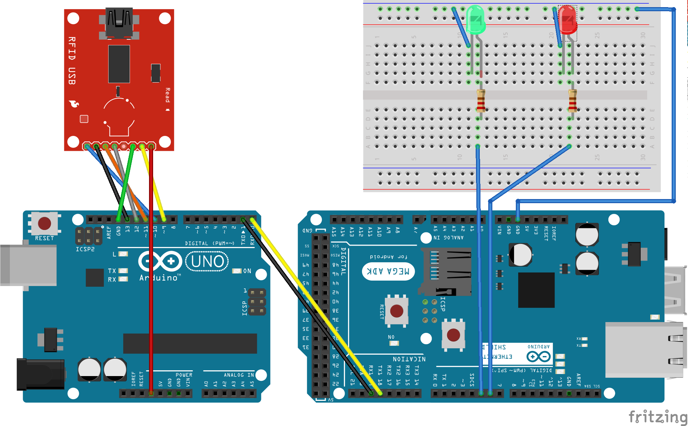

# Big-Brother

## Sobre o Projeto

Este repositório é resultado de um trabalho acadêmico ~~feito em tempo recorde~~ que exigia a construção de um sistema de controle de presença eletrônico para cartões com RFID. Nele é implementado um servidor web PHP com banco de dados MySQL, um aplicativo para Android e a comunicação entre Arduinos Uno e Mega. Os códigos, apesar de pouco documentados, são simples e sua implementação não requer muito trabalho. 

Dentro das pastas [`android`](android), [`arduino`](arduino), [`artigo`](artigo), [`db`](db) e [`server`](server) você encontrará os códigos fontes, esquemas e diagramas utilizados para a construção do protótipo, além do artigo escrito.

## Requisitos

Durante a disciplina de Programação de Sistemas Básicos, ministrada pelo Professor Marcos Cavalheiro ao curso de Ciência da Computação na Universidade Regional do Noroeste do Estado do Rio Grande do Sul ([UNIJUÍ](www.unijui.edu.br)), foi solicitada como atividade avaliativa a implementação de um sistema de controle de ponto eletrônico utilizando dispositivos Arduino. Para tal, foram disponibilizados:

 - 1 Kit módulo leitor RFID, composto por duas TAGs (cartão e chaveiro);
 - 1 Arduino Uno;
 - 1 Arduino Mega;
 - 1 Ethernet Shield para Arduino;
 - 1 Protoboard.

> Observação: o uso de dois Arduinos se comunicando de modo serial fez parte dos requisitos mínimos do trabalho. Com pequenas mudanças na implementação seria possível utilizar apenas um dispositivo.

## Banco de Dados
  
O banco de dados possui apenas duas entidades, `usuarios` e `registros`. Veja abaixo o diagrama de relacionamentos utilizado:

<p align="center">
  
</p>

## Servidor Web

É responsável por atender as solicitações de registro de ponto do Arduino e consultas do Android.  A tabela abaixo mostra os métodos disponíveis e respectivos parâmetros e retornos.

| Nome do Método | Requisição Suportada |      Parâmetros     |                           Retorno                           |
|:--------------:|:--------------------:|:-------------------:|:-----------------------------------------------------------:|
| registrarPonto |         POST         |         tag         | HTTP Code: 201 (sucesso) ou 400 (falha).                    |
|   getUsuarios  |          GET         |          -          | Todos os usuários cadastrados.                              |
|  getRegistros  |          GET         |          -          | Todos os registros de ponto.                                |
|  getRegistros  |          GET         |         tag         | Todos os registros de ponto para a tag informada.           |
|  getRegistros  |          GET         | dataInicio, dataFim | Todos os registros de ponto entre a data e hora informados. |
  
## Arduino/Componentes eletrônicos 

O Arduino Uno e o Arduino Mega são interligados por meio das portas seriais, onde o Arduino Uno é conectado diretamente ao sensor RFID para receber os bytes com o valor da `tag` sempre que uma leitura é realizada. Em seguida ele transfere esses dados para o Arduino Mega, que envia uma requisição POST ao servidor web, solicitando que o registro de ponto seja criado. De acordo com a resposta do servidor (que pode ser um código `HTTP 201` no caso de sucesso, ou `400` para falha), um LED é ligado na protoboard (verde para sucesso ou vermelho para falha). Assim, ao passar cartão, o usuário tem uma resposta visual praticamente imediata. Veja abaixo o diagrama de ligação dos componentes eletrônicos usados no projeto:
 


## Aplicativo Android

O aplicativo Android é responsável por exibir as informações do servidor web e é compatível versões do sistema superiores ao 4.1 (SDK 16). Ele possui apenas uma tela que exibe a lista de registros, permitindo filtrar os resultados por pessoa ou período. Veja abaixo as capturas de tela do aplicativo:

|             |                      |                    |
|:------------:|:---------------------:|:-------------------:|
| Tela Inicial | Opção Filtrar Pessoas | Opção Filtrar Datas |

## Como Implementar

  Poucos simples passos afastam você de ter seu próprio sistema de controle de ponto eletrônico. Siga os procedimentos abaixo para implementar o projeto.

### 1. Configuração do servidor

  Você pode usar quaisquer serviços que suportem arquivos PHP e banco de dados relacional (o exemplo utiliza Apache e MySQL). O [XAMPP](https://www.apachefriends.org/pt_br/index.html) pode ser uma boa alternativa para começar.

#### 1.1 Criação do banco de dados

  Use o [`script de criação`](db/db_create.sql) para criar o banco de dados e as tabelas. Note que qualquer banco de dados com o nome `ponto` será substituído. 

#### 1.2 Cadastro dos usuários no sistema

  Você deve inserir registros na tabela `usuarios`, informando uma `tag` (número de série do cartão RFID), o `nome` da pessoa a utilizar o cartão e a URL de uma foto na coluna `foto`. Para otimizar o desempenho do Android ao baixar e exibir os avatares, opte por imagens com tamanho pequeno.

#### 1.3 Configuração da conexão do BD com o servidor web

  Altere as credenciais de acesso do arquivo [`Constants.php`](server\Include\Constants.php) de acordo com a sua configuração do banco de dados: 
```php
define('DB_USERNAME', 'root');
define('DB_PASSWORD', 'root');
define('DB_HOST', 'localhost');
define('DB_NAME', 'ponto');
```

#### 1.4 Serviço do servidor web

  Copie a pasta `server` para o diretório público do seu servidor web (normalmente `www` ou `htdocs`) e inicie o serviço para hospedar os arquivos PHP.

#### 1.5 Teste o servidor web

  Certifique-se de que o servidor está funcionando corretamente. Como você já cadastrou usuários anteriormente, é possível obter uma resposta válida do método `getUsuarios`. Para isso, abra o navegador no endereço [localhost/server/v1/getRegistros](localhost/server/v1/getRegistros). A listagem dos usuários deve aparecer em formato JSON.

### 2 Montagem dos Arduinos

#### 2.1 Informar o endereço do servidor no código fonte

  O Arduino Mega precisa se comunicar com o seu servidor web para fazer a postagem do registro de ponto. Para isso, ele precisa saber do endereço do servidor. Configure isso no arquivo [receiver.ino](arduino/receiver/receiver.ino):

```c
static const char ENDERECO_SERVIDOR[] = "";
static const char RECURSO_POST[] = "/server/v1/registrarPonto";
```


#### 2.2 Upload do código fonte

  Por meio do [Arduino IDE](https://www.arduino.cc/en/Main/Software) você pode compilar e fazer upload do código fonte de cada Arduino. Certifique-se de fazer isso antes de ligar os componentes.

#### 2.3 Montagem 

  Ligue todos os componentes conforme apresentado no [esquema](arduino/Esquema de ligação.png). 

#### 2.4 Teste

  Após ligar os Arduinos à energia e rede Ethernet, verifique pelo Serial Monitor do Arduino IDE se o Mega está recebendo o endereço IP corretamente. Esse processo pode demorar alguns segundos, dependendo da infraestrutura de rede. Em seguida, basta passar o cartão próximo ao sensor RFID. A resposta será mostrada diretamente no Serial Monitor.
  Caso o servidor web tenha retornado código `201`, o registro foi inserido com sucesso. Se alguma falha tiver ocorrido (como a `tag` lida não constar no banco de dados), o erro será `401`. Erro de código `0` indica que houve um problema de comunicação com a rede (normalmente falha ao obter endereço IP).

### 3 Aplicativo Android 

#### 3.1 Informar o endereço do servidor no código fonte

  Esse é o último. No [Android Studio](https://developer.android.com/studio/index.html), navegue até o arquivo [RDAO.java](android\app\src\main\java\io\github\mathiasberwig\bigbrother\data\remote\RDAO.java) e altere o valor da constante ``URL_SERVIDOR``:

```java
private static final String URL_SERVIDOR = "http://localhost/server/v1";
```

#### 3.2 Compilar e executar aplicativo

  Agora é só compilar o código fonte e executar o app no seu dispositivo ou emulador.

#### 3.3 Comemorar 

  Você conseguiu! :tada::beer:

## Agradecimentos

Deixo registrado o meu muito obrigado ao [Éder Pereira](http://github.com/ederpaulopereira) pela valiosa contribuição no desenvolvimento do trabalho, em especial na construção do protótipo Arduino e programação do servidor web.

Agradeço também ao [Adilson Thomsen](http://blog.filipeflop.com/author/adilson/) que publicou o artigo [Controle de Acesso Usando Leitor RFID com Arduino](http://blog.filipeflop.com/wireless/controle-acesso-leitor-rfid-arduino.html) no [Blog FILIPEFLOP](http://blog.filipeflop.com/).

## Licença

Este código está licenciado sob [Apache Software License, Version 2.0](http://www.apache.org/licenses/LICENSE-2.0).

Veja [`LICENSE`](LICENSE) para o arquivo completo (em inglês).

    Copyright (C) 2015 [Mathias Berwig](https://github.com/MathiasBerwig).
    
    Licensed under the Apache License, Version 2.0 (the "License");
    you may not use this file except in compliance with the License.
    You may obtain a copy of the License at
    
        http://www.apache.org/licenses/LICENSE-2.0
    
    Unless required by applicable law or agreed to in writing, software
    distributed under the License is distributed on an "AS IS" BASIS,
    WITHOUT WARRANTIES OR CONDITIONS OF ANY KIND, either express or implied.
    See the License for the specific language governing permissions and
    limitations under the License.
